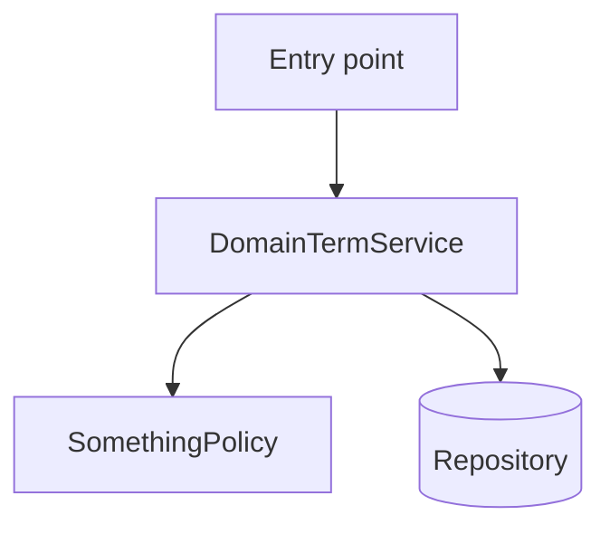

# <Feature Name> — Architecture Design

**Status:** [Draft / Confirmed]
**Source PRD:** `.sdd/{yyyy-MM-dd}-{feature-slug}/PRD.md`
**Tech context:** [key stack / layer from PROJECT.md, e.g. .NET · Clean Architecture]

---

## 1. Design Goal & Guiding Principle

- **In one sentence:** what this design has to make possible (restated from the PRD, technically).
- **Guiding principle:** how this design keeps the next engineer's load low — the single most important structural choice (e.g. "isolate pricing rules behind one strategy so new rule types are add-only").

---

## 2. Change Scope

What this feature touches, adds, and deliberately leaves alone. Keep the blast radius small and justified.

| Area | Action | What / Why |
| :--- | :--- | :--- |
| [existing module / layer] | **Modify** | [what changes and why it must] |
| [new module] | **Add** | [what it introduces] |
| [tempting-but-excluded area] | **Not touched** | [why it stays out of scope] |

---

## 3. New Classes / Modules

Each new unit and the single responsibility it exists for. If two rows share one reason to change, merge them.

| Name | Kind | Responsibility (purpose) | Collaborators | Satisfies (PRD scenario) |
| :--- | :--- | :--- | :--- | :--- |
| `[DomainTermService]` | Service | [the one business thing it owns — verb phrase] | `[Repo]`, `[Gateway]` | [Scenario: ...] |
| `[DomainTerm]` | Entity / Aggregate | [what state/invariant it protects] | — | [Scenario: ...] |
| `[SomethingPolicy]` | Strategy | [the decision it encapsulates] | — | [Scenario: ...] |

> Interfaces should be simple; complexity lives inside. Reject any row whose caller must sequence multiple calls to complete one business action.

---

## 4. Modified Components

Existing units this feature changes, and how.

| Component | Current role | Change needed |
| :--- | :--- | :--- |
| `[ExistingHandler]` | [what it does today] | [the specific change] |

---

## 5. Component Relationships

---

## 6. Extensibility & Handoff Notes

Written for the engineer who picks this up next and has to add the *next* requirement.

- **Most likely next requirement:** [what will probably be asked for next].
- **Where it lands:** [the seam that absorbs it — the interface/strategy/config surface to extend].
- **How to add it:** [the add-only path — "implement `IXxxPolicy` and register it", not "edit the switch in `Yyy`"].
- **Patterns applied & why:** [Strategy / Factory / Adapter … tied to the axis of change, not decoration].
- **Do not hardcode:** [values or branches that must stay configurable / polymorphic].
- **Known debt / deferred:** [what is intentionally left simple for now, and the signal that it's time to revisit].

---

## 7. Traceability

Every PRD acceptance-criteria scenario maps to the component(s) that fulfill it.

| PRD Scenario | Fulfilled by |
| :--- | :--- |
| [Scenario: happy path] | `[DomainTermService]` |
| [Scenario: boundary] | `[SomethingPolicy]` |
| [Scenario: exception] | `[DomainTermService]` + `[DomainTerm]` invariant |

---

## 8. Risks & Open Decisions

- **Risks / trade-offs:** [where this design accepts a cost, and why it's acceptable].
- **Open decisions (for implementation):** [anything left `TBD` that `/tdd` must resolve].
